# Credit_Risk_Analyis

## Overview of Analysis
  Credit risk is an inherently unbalanced classification problem due to good loans outnumbering risky loans.  In order to train and evaluate the models with unbalanced classes, six different machine learning methods were used:
  - ROS
  - SMOTE
  - Undersampling
  - SMOTEENN
  - Balanced Random Forest Classifier
  - Easy Ensemble Classifer
 

### Resources
- Data Source: [LoanStats_2019q1.csv](https://github.com/stephenanayashilliard/Credit_Risk_Analyis/blob/main/Resources/LoanStats_2019Q1.csv)

- Software:
 - Python 3.6.1
 - Jupyter Notebook
   - Libraries
     - Numpy
     - Pandas
     - Pathlib
     - Path
     - scipy
     - scikit-learn
     - imbalanced-learn
  - Collections
    - Counter  
 

## Results of Analysis

- ### ROS (Random Oversampling)
 
- #### Balanced Accuracy Score

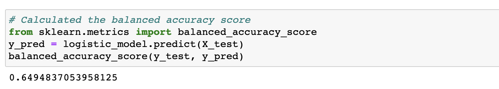

- #### Imbalanced Classification Report
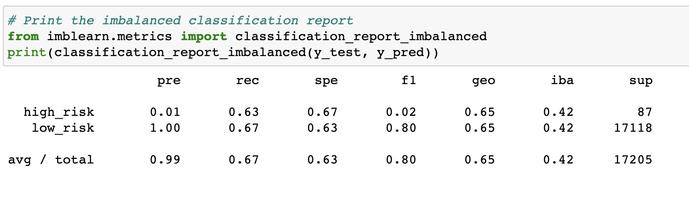
 
- ### SMOTE (Synthetic Minority Oversampling Technique)

- #### Balanced Accuracy Score
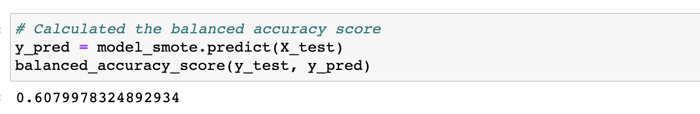

- #### Imbalanced Classification Report
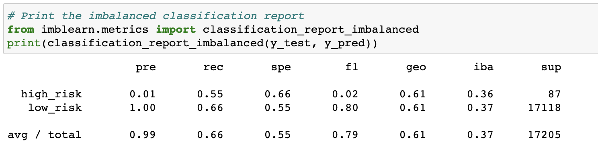

- ### Undersampling

- #### Balanced Accuracy Score
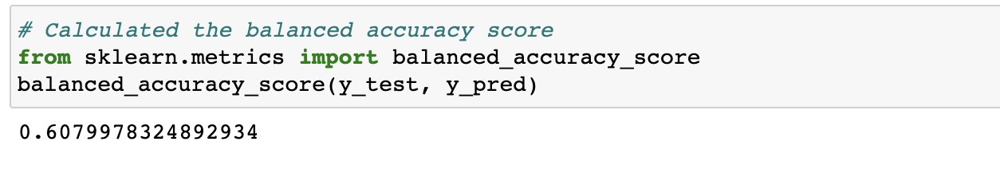

- #### Imbalanced Classification Report
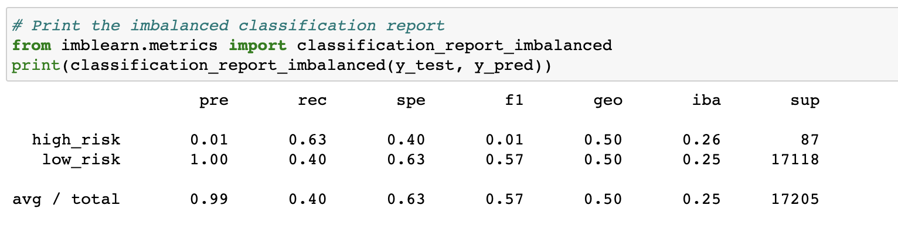

- ### SMOTEENN (Combined Over and Undersampling)

 - #### Balanced Accuracy Score

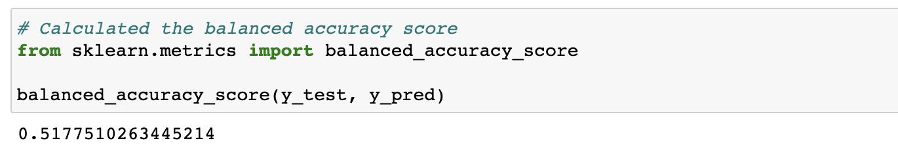

- #### Imbalanced Classification Report

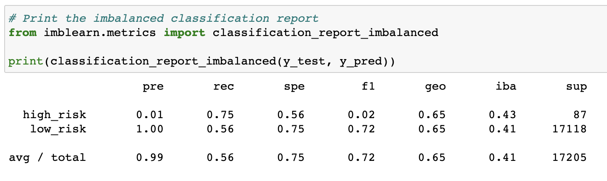

- ### Balanced Random Forest Classifier

- #### Balanced Accuracy Score
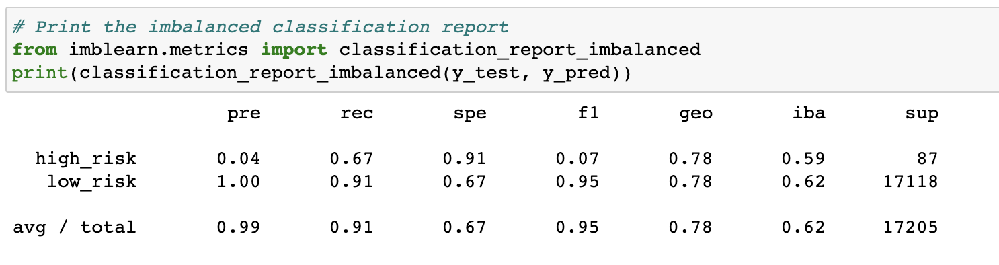
- #### Imbalanced Classification Report
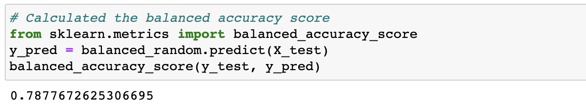

- ### Easy Ensemble Classifier

- #### Balanced Accuracy Score
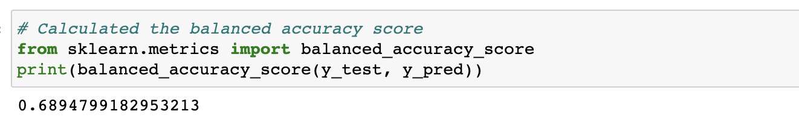
- #### Imbalanced Classification Report
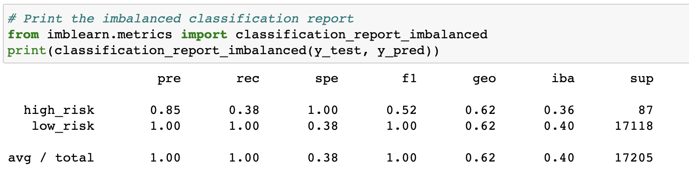

- ## Summary

s

- ### Recommendation

It is recommended that the Balanced Random Forest Classifier be used to assist in machine learning due to it having the the best Balanced Accuracy Score of 78% and the best overall Average Recall of 91%.
